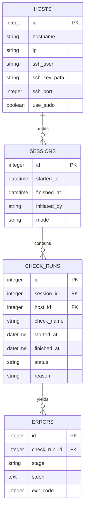

# Data Model & ERD

Auditron stores **configuration, sessions, check runs, errors**, and **normalized artifacts** (packages, files, sockets, processes, etc.). Content blobs (changed text/configs) are gzip‑compressed and de‑duplicated by SHA‑256.

Further tables specialize results: `RPM_PACKAGES`, `RPM_VERIFIED_FILES`, `FILE_META`, `FILE_SNAPSHOTS`, `USERS`, `GROUPS`, `BASH_HISTORY`, `LOGIN_EVENTS`, `LISTEN_SOCKETS`, `PROCESSES`, `PROC_OPEN_FILES`, `SERVICES`, `NMAP_RESULTS`, `RESOURCE_SNAPSHOTS`, `DISK_USAGE`, `OS_INFO`, `FIREWALL_STATE`, `NET_INTERFACES`, `HW_*`.
