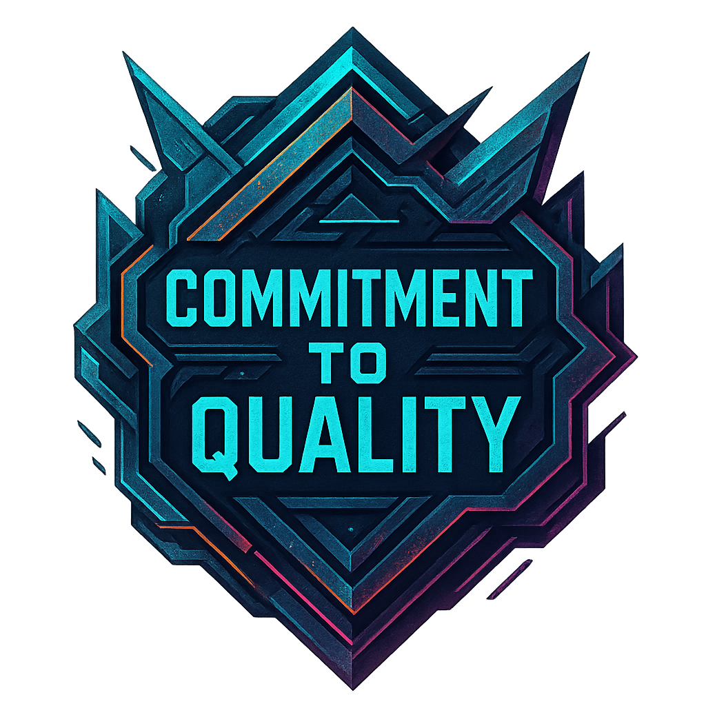

# Auditron Quality Commitment: Unyielding Standards

<div align="center">
  
</div>

This document outlines Auditron's **unyielding commitment to code quality** and the automated systems in place to maintain and improve our standards.

## 🛡️ Quality Philosophy

> **"Quality is not an act, it is a habit."** - Aristotle

At Auditron, we believe that:
- **Quality cannot regress** - Every commit must maintain or improve our standards
- **Metrics matter** - Measurable quality indicators guide our development
- **Automation prevents human error** - Tools enforce what policies promise
- **Excellence is the minimum standard** - Good enough is never good enough

## 📊 Quality Metrics & Thresholds

### Current Achievement Status 🏆

| Metric | Current Score | Target | Status |
|--------|---------------|--------|--------|
| **Test Coverage** | **94.12%** | ≥90% | ✅ **EXCEEDS TARGET** |
| **Test Count** | **128 tests** | Growing | ✅ **COMPREHENSIVE** |
| **Pylint Score** | **9.17/10** | ≥9.0 | ✅ **EXCELLENT** |
| **All Linters** | **100% passing** | 100% | ✅ **PERFECT** |

### Quality Regression Protection

Our automated systems **REJECT** any commit that causes:

#### 🚨 Critical Regressions (Immediate Failure)
- **Coverage decrease** > 0.1% without justification
- **Pylint score decrease** > 0.05 points  
- **Test count decrease** > 2 tests (prevents accidental deletion)
- **Any linting failures** (ruff, black, isort, flake8, pyright)

#### ⚠️ Quality Warnings
- Coverage below 90% (currently **exceeding** at 94.12%)
- Pylint score below 9.0 (currently **exceeding** at 9.17)
- Missing tests for new code
- Insufficient documentation

## 🔧 Automated Quality Systems

### 1. Pre-commit Quality Gate

Every commit is automatically validated through our quality pipeline:

```bash
# Triggered automatically on git commit
1. Ruff (primary linter) - must pass
2. Black (code formatting) - must pass  
3. Isort (import sorting) - must pass
4. Flake8 (style checking) - must pass
5. Pylint (comprehensive analysis) - must pass
6. Pyright (type checking) - must pass
7. Quality metrics enforcement - MUST NOT REGRESS
```

**Result:** Commits that lower quality are **automatically rejected**.

### 2. Continuous Metrics Tracking

The `scripts/update_metrics.py` tool provides:

- **Real-time quality measurement** via test execution
- **Automatic documentation updates** with current metrics
- **Regression detection** comparing current vs. historical metrics
- **Quality enforcement** in pre-commit hooks

### 3. Documentation Synchronization

All project documentation automatically reflects current metrics:
- README.md badges show live coverage/quality scores
- Test documentation shows current test counts
- Architecture docs reflect actual code quality

## 📈 Quality Improvement Process

### For Developers

When quality standards are not met, the system provides **actionable guidance**:

```
🛑 COMMIT REJECTED - QUALITY REGRESSION DETECTED!
============================================================

🚨 COVERAGE REGRESSION: 94.12% → 92.50% (-1.62%)
🚨 PYLINT REGRESSION: 9.17 → 8.95 (-0.22)

💪 Our commitment to code quality is UNYIELDING!
📈 Improve your code and try again:
   • Add more tests to increase coverage
   • Fix pylint warnings and errors
   • Ensure no tests were accidentally deleted

📊 Current quality metrics:
   🧪 Tests: 125 (target: ≥128)
   📈 Coverage: 92.50% (target: ≥94.12%)
   🏆 Pylint: 8.95/10 (target: ≥9.17)
```

### Quality Improvement Strategies

1. **Increase Test Coverage**
   ```bash
   # Add comprehensive tests for new features
   pytest --cov=auditron --cov=utils --cov=strategies --cov-report=html
   # Open htmlcov/index.html to see coverage gaps
   ```

2. **Improve Pylint Score**
   ```bash
   # Run pylint with full details
   pylint auditron.py utils/ strategies/ --score=yes
   # Fix warnings and errors shown
   ```

3. **Maintain Test Count**
   ```bash
   # Ensure new features have tests
   # Use TDD: write tests first, then implementation
   ```

## 🎯 Quality Commands

### Manual Quality Checks

```bash
# Update all metrics and documentation
make update-metrics

# Check if metrics are current
make check-metrics  

# Enforce quality standards (same as pre-commit)
make enforce-quality

# Run comprehensive quality check
make check  # Includes lint + test
```

### Advanced Quality Analysis

```bash
# Comprehensive coverage report
pytest --cov=auditron --cov=utils --cov=strategies --cov-report=html --cov-report=term-missing

# Detailed pylint analysis
pylint auditron.py utils/ strategies/ --reports=yes

# All linting tools
ruff check .
black --check .
isort --check-only .
flake8 .
pyright .
```

## 🏆 Quality Achievements

### Historical Progress

| Date | Coverage | Pylint | Tests | Milestone |
|------|----------|--------|-------|-----------|
| 2024-12 | **94.12%** | **9.17** | **128** | 🎯 **EXCELLENCE ACHIEVED** |
| Previous | 89.71% | 9.17 | 118 | Quality improvement phase |
| Baseline | ~75% | ~8.5 | ~100 | Initial quality foundation |

### Quality Milestones Unlocked 🏅

- ✅ **90%+ Coverage Club** - Achieved 94.12% coverage
- ✅ **Pylint Excellence** - Maintained 9.17/10 score  
- ✅ **Zero Regression** - Automated quality protection
- ✅ **Comprehensive Testing** - 128+ tests covering all scenarios
- ✅ **Linting Perfection** - All 6 linters passing consistently

## 🚀 Future Quality Goals

### Short Term (Next Release)
- [ ] Maintain **95%+ coverage** on all new code
- [ ] Achieve **9.5+/10 Pylint score** 
- [ ] Add **property-based testing** with Hypothesis
- [ ] Implement **mutation testing** for test quality

### Long Term (Roadmap)
- [ ] **100% branch coverage** on critical paths
- [ ] **Performance regression testing**
- [ ] **Security scanning** integration
- [ ] **Complexity metrics** tracking

## 🔍 Quality Monitoring

### Metrics Storage
- **Location:** `.project-metrics.json` (version controlled)
- **Updates:** Automatic via pre-commit hooks
- **History:** Git history provides metric timeline

### Quality Dashboard
Current metrics are visible in:
- Repository README badges
- Documentation headers  
- CI/CD pipeline results
- Pre-commit hook output

## 💪 The Quality Commitment

**We solemnly commit that:**

1. **No commit shall lower our quality standards**
2. **Every change must be tested and measured**
3. **Quality tools are mandatory, not optional**
4. **Documentation reflects reality, always**
5. **Excellence is our minimum acceptable standard**

This is not merely policy - it is **automatically enforced** by our tools.

---

*Quality is not an accident. It is the result of intelligent effort, high intention, sincere execution, and the wisdom to choose excellence over mediocrity.*

**Auditron: Where Code Quality is Unyielding.** 🛡️✨